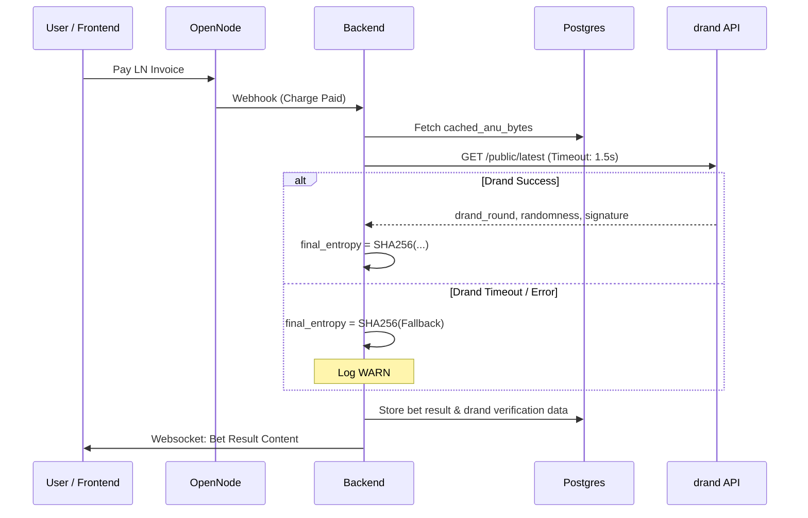

# Drand Integration Design

---
**Version:** 1.0
**Status:** DRAFT
**Last Modified:** 2026-03-02
---

## 1. Introduction
This document defines the architecture and integration strategy for consuming public randomness from the `drand` network (Distributed Randomness Beacon) into the Quantum BTC Roulette MVP. 

The goal is to provide **Provably Fair** outcomes by mixing our local quantum entropy (ANU QRNG) with a publicly verifiable, unbiasable, and unpredictable randomness beacon.

## 2. Integration Architecture

### 2.1 Public Endpoints
We will utilize the public HTTP APIs provided by the League of Entropy (e.g., `https://api.drand.sh`).
*   **Endpoint:** `/public/latest` (Retrieves the latest randomness round).
*   **Network:** `default` (chained randomness, fast).

### 2.2 Data Flow & Mixing
As per the `Manual_Tecnico_Alto_Nivel.md`, the final entropy is calculated as:
`final_entropy = SHA256(server_seed || client_seed || drand_randomness || cached_anu_bytes || bet_id)`

#### Sequence Diagram

1.  **Bet Received:** User pays the LN invoice. OpenNode webhook triggers the resolution.
2.  **Fetch Local:** The system pops `cached_anu_bytes` from the local `entropy_buffer`.
3.  **Fetch Public (drand):** The system makes a synchronous HTTP GET to `https://api.drand.sh/public/latest`.
4.  **Mixing:** The system hashes all components.
5.  **Storage:** The system stores the `drand` `round` number, `randomness` hex, and `signature` in the `bets` table for public verification.
6.  **Resolution:** `result = final_entropy % 37`.

## 3. Resiliency and Fallback Strategy

Relying on a third-party public API introduces latency and availability risks. The Lightning Network user experience demands instant resolution (under 3 seconds visual delay).

### 3.1 Timeout Strategy
*   **Drand Fetch Timeout:** The HTTP request to the `drand` API will have a strict **restriced timeout of 1500ms (1.5 segundos)**.

### 3.2 Degradation (Fallback)
If the `drand` request times out, fails (5xx), or the response is malformed:
1.  **Do NOT reject the bet.** Resolving the bet and paying the user takes precedence over public verifiability to avoid holding user funds hostage.
2.  **Fallback Formula:** `final_entropy = SHA256(server_seed || client_seed || "DRAND_UNAVAILABLE_" + unix_timestamp || cached_anu_bytes || bet_id)`
3.  **Storage:** Set `drand_round = null` and log a strict `WARN` indicating drand was unreachable for `bet_id`.
4.  **UI Feedback:** The frontend will show "Provably Fair: Partial (Quantum Only)" instead of "Full (Quantum + Drand)".

## 4. Database Schema Updates

The `bets` table needs to be updated to store drand verification data.

*   `drand_round` (BIGINT, nullable): The round number used.
*   `drand_randomness` (VARCHAR, nullable): The hex string of the randomness.
*   `drand_signature` (VARCHAR, nullable): The BLS signature of the round (optional, but good for client-side offline verification).

## 5. Security Considerations
*   **No API Keys:** Drand is public. No secrets to manage.
*   **Replay Attacks:** We always fetch `/latest`, ensuring the round is always moving forward.
*   **Verification:** The frontend can independently fetch the `drand_round` from the public API and verify if the stored `drand_randomness` matches.
