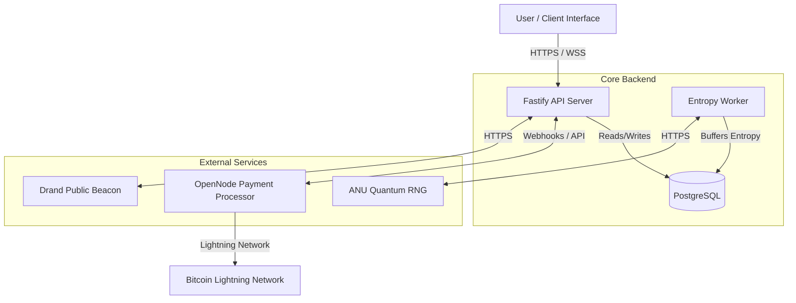
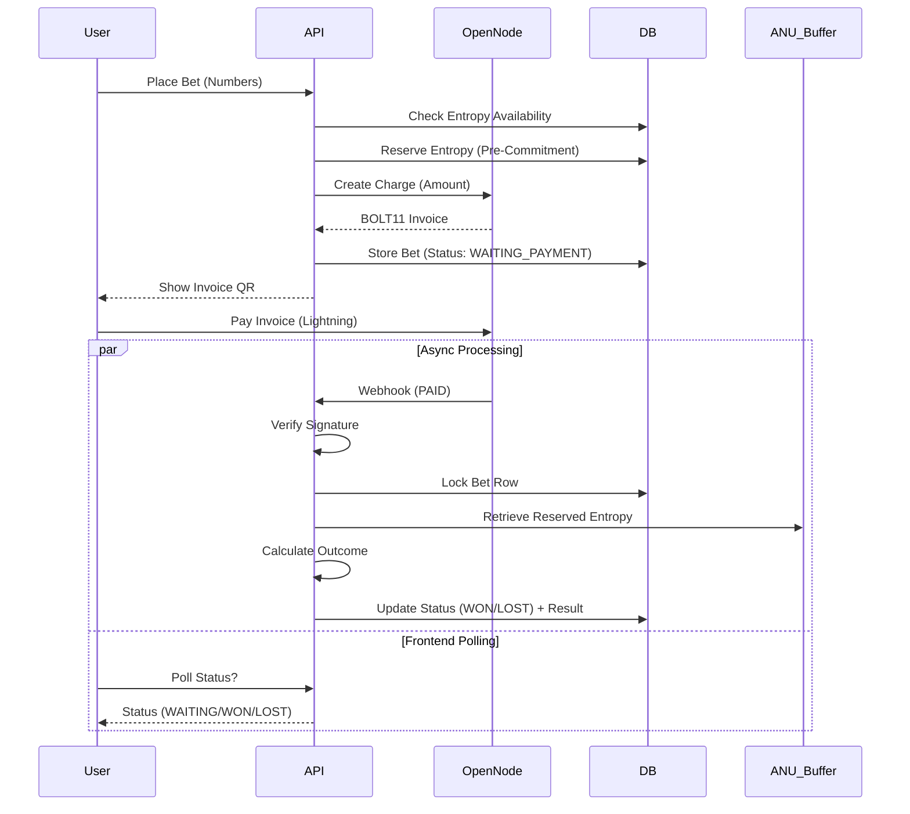
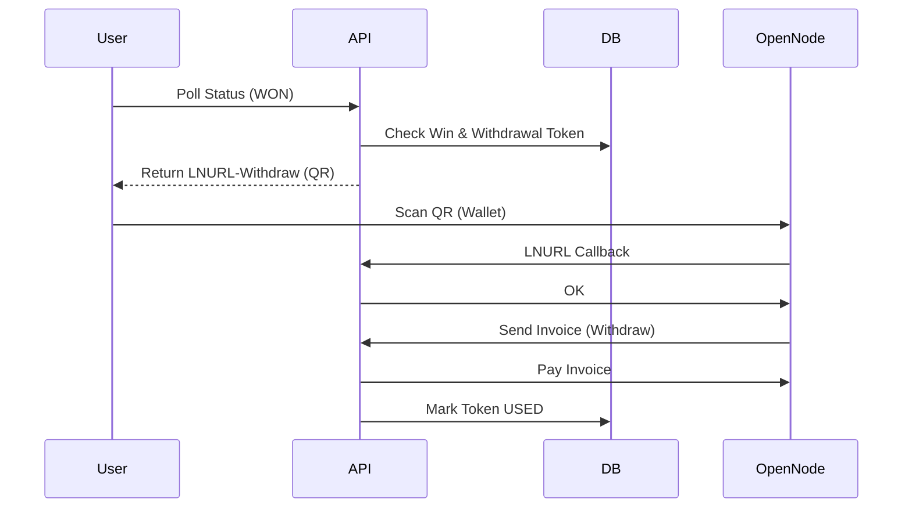

# Architecture Overview - QuantumBTC

> **ID:** QM_Architecture_Overview
> **Version:** 1.1
> **Last Updated:** 2026-04-08
> **Status:** DRAFT

## 1. High-Level System Architecture

The QuantumBTC backend is a monolithic high-performance Node.js application (Fastify) integrated with external services for Lightning payments and entropy generation.

### Component Roles
1.  **Fastify API Server:** Handles all HTTP requests, game logic, authentication (stateless), and payment orchestration.
2.  **PostgreSQL (Hosted on Supabase):** Primary persistence layer. Stores bets, transactions, and the entropy buffer. Uses `BigInt` for Satoshi precision.
3.  **Entropy Worker:** A background process that aggressively fetches quantum random numbers from ANU. **Includes automatic fallback to standard CSPRNG (Crypto)** if the ANU API limit is reached or returns errors (403/500).
4.  **OpenNode:** Managed node provider for generating invoices and handling LNURL-withdraw requests.
5.  **Drand:** Used as a secondary public beacon to ensure the "provably fair" chain cannot be manipulated by the server alone.

## 2. Satoshi Lifecycle (Data Flows)

### 2.1 Non-Custodial Betting Flow (Pay-Per-Spin)

### 2.2 Prize Claiming Flow (Win)

