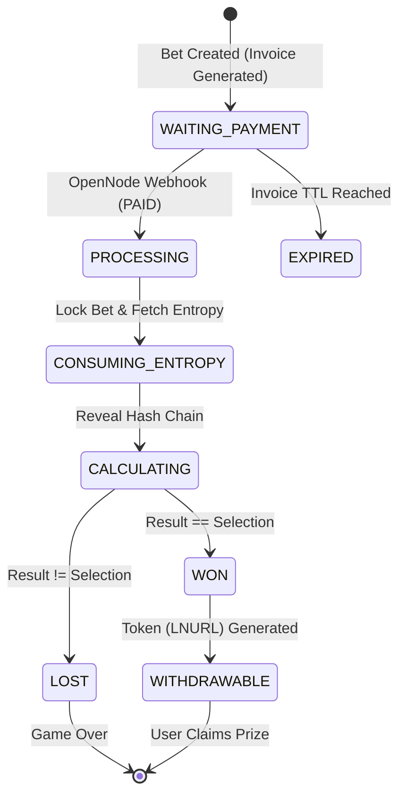
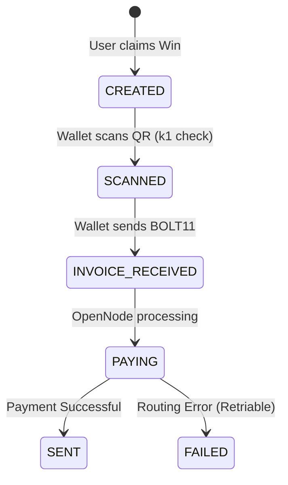

# State Transition Models - Quantum BTC

> **Artifact ID:** 20260130_State_Models_v1.0
> **Version:** 1.0
> **Date:** 2026-01-30
> **Status:** Draft

## 1. Betting & Payment Lifecycle (Pay-Per-Spin)

The atomic lifecycle of a single game round with integrated payment.

## 3. Withdrawal Token Lifecycle (LNURL)

