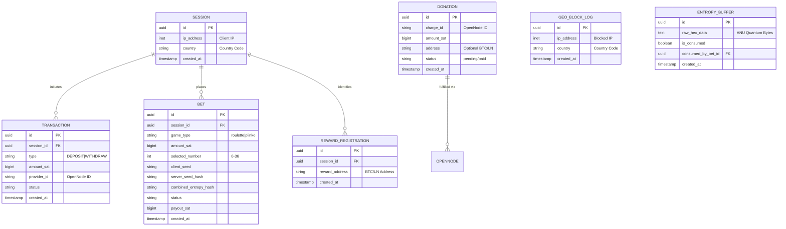

# Database Schema - QuantumBTC

> **ID:** QM_Database_Schema
> **Version:** 1.8
> **Last Updated:** 2026-05-07
> **Status:** APPROVED

## 1. Entity-Relationship Diagram (ERD)



## 2. Data Dictionary

### 2.1 Table: `sessions`
Typically ephemeral, mostly for audit/logging in non-custodial mode.
*   **id:** UUID v4.
*   **ip_address:** `INET`. Client IP address captured at session initialization for compliance and audit.
*   **country:** `VARCHAR(2)`. The 2-letter ISO country code detected for the session IP.
*   **created_at:** Timestamp.

### 2.2 Table: `bets`
The core ledger of gameplay.
*   **game_type:** `VARCHAR(20)`. Type of game ('roulette', 'plinko'). Defaults to 'roulette'.
*   **amount_sat:** `BIGINT`. The wager (from Invoice).
*   **payout_sat:** `BIGINT`. The win amount (0 if lost).
*   **invoice_id:** `VARCHAR`. Link to OpenNode Charge.
*   **withdrawal_token_id:** `UUID`. Link to claim token (if won).
*   **status:** 'WAITING_PAYMENT', 'PROCESSING', 'WON', 'LOST'.
*   **entropy_id:** `UUID`. FK to `entropy_buffer`.
*   **bet_details:** `JSONB`. Numbers selected.

### 2.3 Table: `entropy_buffer`
Pre-fetched quantum randomness.
*   **raw_hex_data:** High-quality entropy from ANU.
*   **is_consumed:** Index for fast retrieval (`WHERE is_consumed = false LIMIT 1`).

### 2.4 Table: `geo_block_logs`
Audit log for blocked IP addresses.
*   **id:** UUID v4.
*   **ip_address:** `INET`. The blocked client IP address.
*   **country:** `VARCHAR(2)`. The 2-letter ISO country code of the blocked IP.
*   **created_at:** Timestamp.

### 2.5 Table: `reward_registrations`
Links a session to a reward address.
*   **session_id:** UUID (FK to `sessions`).
*   **reward_address:** BTC Address or Lightning Address.
*   **created_at:** Timestamp.

### 2.6 Table: `donations`
Records voluntary user contributions. Can be anonymous or associated with an address.
*   **id:** UUID v4.
*   **charge_id:** `VARCHAR`. Link to OpenNode Charge for webhook verification.
*   **amount_sat:** `BIGINT`. The donation amount.
*   **address:** `VARCHAR`. User's provided BTC/LN address (Optional).
*   **status:** 'pending' or 'paid'.
*   **created_at:** Timestamp.

## 3. SQL Schema (schema.sql)

```sql
CREATE EXTENSION IF NOT EXISTS "uuid-ossp";

CREATE TABLE sessions (
  id UUID PRIMARY KEY DEFAULT uuid_generate_v4(),
  ip_address INET,
  country VARCHAR(2),
  created_at TIMESTAMP WITH TIME ZONE DEFAULT NOW()
);

CREATE TABLE geo_block_logs (
  id UUID PRIMARY KEY DEFAULT uuid_generate_v4(),
  ip_address INET NOT NULL,
  country VARCHAR(2) NOT NULL,
  created_at TIMESTAMP WITH TIME ZONE DEFAULT NOW()
);

CREATE TABLE entropy_buffer (
  id UUID PRIMARY KEY DEFAULT uuid_generate_v4(),
  raw_hex_data TEXT NOT NULL,
  is_consumed BOOLEAN DEFAULT FALSE,
  consumed_by_bet_id UUID,
  created_at TIMESTAMP WITH TIME ZONE DEFAULT NOW()
);

CREATE TABLE bets (
  id UUID PRIMARY KEY DEFAULT uuid_generate_v4(),
  session_id UUID REFERENCES sessions(id),
  game_type VARCHAR(20) DEFAULT 'roulette',
  amount_sat BIGINT NOT NULL,
  payout_sat BIGINT DEFAULT 0,
  invoice_id VARCHAR(100),
  status VARCHAR(20) DEFAULT 'WAITING_PAYMENT',
  entropy_id UUID REFERENCES entropy_buffer(id),
  bet_details JSONB,
  created_at TIMESTAMP WITH TIME ZONE DEFAULT NOW()
);

CREATE TABLE withdrawal_tokens (
  id UUID PRIMARY KEY DEFAULT uuid_generate_v4(),
  session_id UUID REFERENCES sessions(id),
  k1 VARCHAR(255) UNIQUE,
  amount_sat BIGINT,
  is_used BOOLEAN DEFAULT FALSE,
  created_at TIMESTAMP WITH TIME ZONE DEFAULT NOW()
);

CREATE TABLE reward_registrations (
  id UUID PRIMARY KEY DEFAULT uuid_generate_v4(),
  session_id UUID REFERENCES sessions(id) UNIQUE,
  reward_address VARCHAR(255) NOT NULL,
  created_at TIMESTAMP WITH TIME ZONE DEFAULT NOW()
);

CREATE TABLE donations (
  id UUID PRIMARY KEY DEFAULT uuid_generate_v4(),
  charge_id VARCHAR(100) UNIQUE NOT NULL,
  amount_sat BIGINT NOT NULL,
  address VARCHAR(255),
  status VARCHAR(20) DEFAULT 'pending',
  created_at TIMESTAMP WITH TIME ZONE DEFAULT NOW()
);
```
